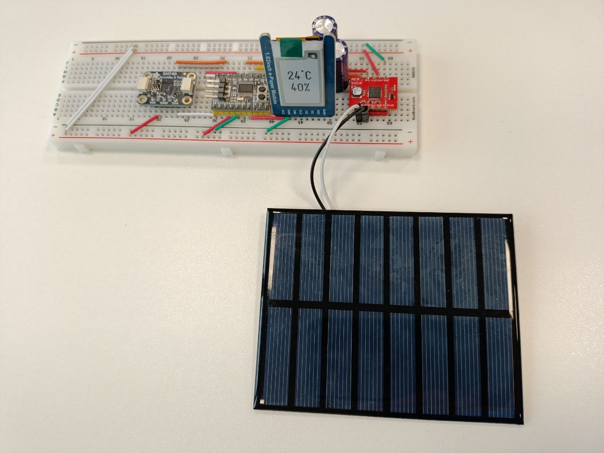

# Temperature and humidity measuring device

Consists of:

- [SHT40 Temperature & Humidity Sensor](https://www.adafruit.com/product/4885);
- [1.02inch E-Ink display module](https://www.waveshare.com/1.02inch-e-paper-module.htm);
- [AEM10491 solar energy harvesting module](https://www.tindie.com/products/jaspersikken/solar-harvesting-into-supercapacitors/);
- two supercaps to store the energy;

all controlled by a rust-powered STM32G031 micro!

## Images

### Breadboard edition

## Solar harvester

### Voltage thresholds

Enable threshold: 3.92V

Disable threshold: 3.60V

Unfortunately, the system doesn't work when supplied by 2.5V.

[AEM10491 datasheet](https://www.mouser.sk/datasheet/3/3770/1/DS_AEM10941.pdf)
